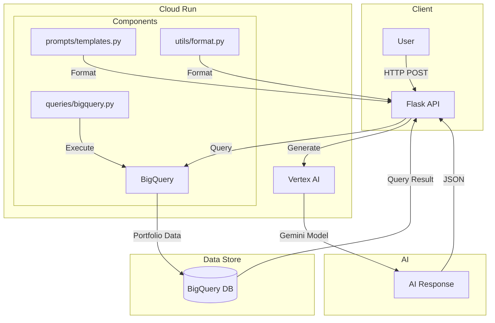
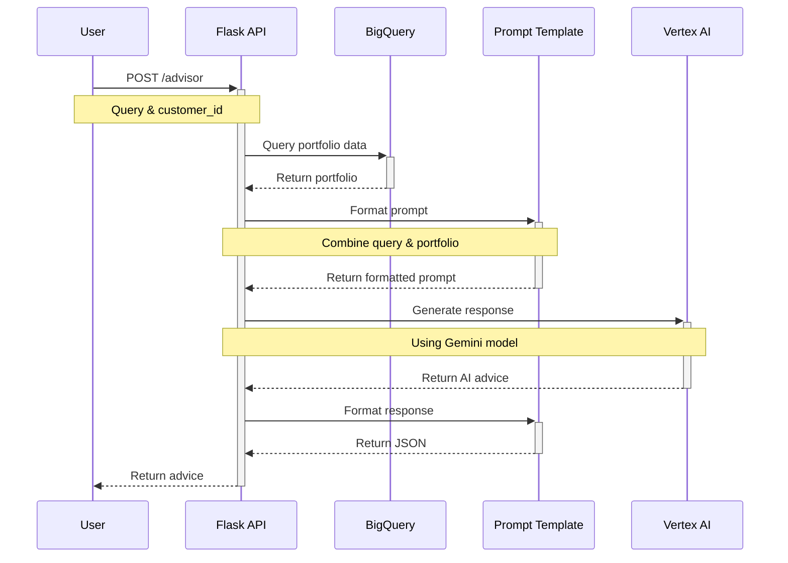

# 💼 Advisor Copilot – Private Banking (GCP)

An intelligent AI-based financial advisor for private banking customers, powered by Google Cloud Platform. It answers investment-related queries, analyzes customer portfolios, and suggests next-best actions — using structured financial data and Google's generative AI models.

## 🎯 System Architecture



### Sequence Flow



### Component Roles
- **API Layer** (`api/main.py`): Handles HTTP requests, orchestrates data flow
- **Prompts** (`prompts/templates.py`): Manages AI conversation templates
- **Queries** (`queries/bigquery.py`): Handles database operations
- **Utils** (`utils/format.py`): Data formatting and presentation

### Data Flow
1. Client sends POST request with customer_id and query
2. System fetches portfolio data from BigQuery
3. Data is formatted for AI consumption
4. Gemini model generates financial advice
5. Response is formatted and returned to client

---

## 🚀 Architecture Overview

Minimal setup using:

- **Vertex AI (Gemini)** — Natural language understanding and response generation  
- **Cloud Run** — Stateless API backend for logic and orchestration  
- **BigQuery** — Portfolio, transaction, and financial data store  

```
User → Cloud Run API → BigQuery → Vertex AI → Response
```

---

## 📁 Project Structure

```
advisor-copilot/
├── api/
│   └── main.py                 # Cloud Run app (Flask or FastAPI)
├── prompts/
│   └── templates.py            # Prompt templates for financial advice
├── queries/
│   └── bigquery.py             # BigQuery query builder
├── utils/
│   └── format.py               # Format portfolio & results
├── requirements.txt
├── Dockerfile
└── README.md
```

---

## 🧠 Sample Prompt Format

```text
You are a financial advisor. Here is the customer portfolio:
- Equity: ₹8,00,000 (Large-cap 60%, Mid-cap 40%)
- Debt: ₹2,00,000
- Cash: ₹1,00,000

Customer asks: "Should I reduce my exposure to mid-cap now?"

Provide a clear, compliant, and actionable suggestion.
```

---

## 🛠️ Deployment (Cloud Run)

### 1. Enable Required APIs
```bash
gcloud services enable run.googleapis.com bigquery.googleapis.com aiplatform.googleapis.com
```

### 2. Deploy to Cloud Run
```bash
gcloud run deploy advisor-copilot   --source .   --region us-central1   --allow-unauthenticated
```

---

## 🔐 Environment Variables

| Variable           | Description                    |
|--------------------|--------------------------------|
| `PROJECT_ID`       | Your GCP project ID            |
| `LOCATION`         | Vertex AI location (e.g., `us-central1`) |
| `MODEL_NAME`       | e.g., `gemini-1.5-pro-preview` |
| `BQ_DATASET`       | BigQuery dataset name          |

---

## 📊 BigQuery Table Schema (Example)

### `customer_portfolio`
| Column         | Type     |
|----------------|----------|
| customer_id    | STRING   |
| asset_class    | STRING   |
| sub_category   | STRING   |
| amount         | FLOAT    |
| last_updated   | TIMESTAMP |

---

## ✅ Example Query Flow

1. **User**: “What’s my risk exposure today?”
2. **API** fetches portfolio from BigQuery
3. **Prompt** constructed with portfolio data
4. **Vertex AI** returns advice
5. **Response** sent back to user frontend (web/chatbot)

---

## 📌 To Do (MVP+ Scope)

- [x] Cloud Run backend
- [x] Vertex AI integration
- [x] BigQuery connector
- [ ] RAG via Vector Search (optional)
- [ ] Dialogflow/Chat UI integration
- [ ] Risk profiling models

---

## 📄 License

MIT License. For internal/prototype use only. Financial advice must comply with regulatory frameworks in your jurisdiction.

---

## 👤 Author

Built by [Your Name / Org]. Powered by GCP.